# CS205 Final project
# Implementation and parallelization of the secular Redfield equations

Florian Hase, Hannah Sim, and Teresa Tamayo

The critical process of energy harvesting in solar cells is to quickly convert excited states generated by photon absorption into separated charge carriers for long term energy storage. Nature has developed highly efficient and fast complexes which mediate the transfer of excited state energies from the light harvesting molecules, which absorb photons, to the location where the harvested energy is used to initiate a cascade of chemical reactions. These complexes are collectively referred to as light-harvesting complexes.


<center>

</center> 


**Figure:** Cartoon and stick representation of the Fenna-Matthews-Olson (FMO) complex. The FMO complex is a photosynthetically active protein complex in green sulfur bacteria consisting of three subunits with eight bacteriochlorophylls each. Highly efficient excited state transfer is mediated by this pigment-protein complex due to the close-to-optimal geometrical arrangment of the bacteriochlorophyll molecules within the protein shell. 

Understanding the energy transfer in photosynthesis from the absorption of the photon to the charge separation is crucial for improving the efficiency of solar cells. However, experimental techniques for measuring the transfer of excited states are limited due to short time scales and tight packing of excitation sites. 

<center>
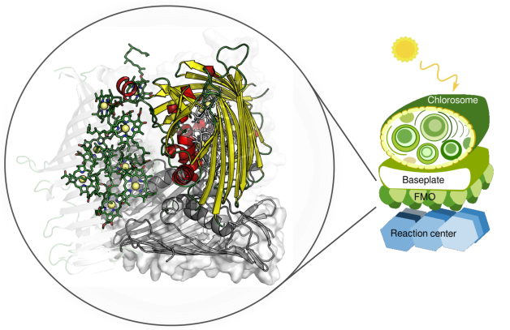
</center>

**Figure:**
Fenna-Matthews-Olson complex location inside of the photosystem of green sulfur bacteria. This photosynthetically active protein-pigment complex mediates the exciton transfer from the light harvesting chlorosomes to the reaction center. Goal of this project is to implement a fast method for computing how excited states are transferred across such complexes and to provide a tool to scan the space of excitonic systems to find candidate systems for improving the efficiency of solar cells. 


The dynamics of excited states in protein complexes has been studied extensively in computer simulations. Several theoretical models at different levels exist to describe the exciton dynamics but even the simplest suitable models can only be applied to a relatively small number of excitonic sites (< 30) due to the computational scaling of the algorithms with the number of excitonic sites in the considered system. 


<iframe src="https://player.vimeo.com/video/205391380" width="640" height="480" frameborder="0" webkitallowfullscreen mozallowfullscreen allowfullscreen></iframe>
<p><a href="https://vimeo.com/205391380">Energy Transfer in LH2</a> from <a href="https://vimeo.com/dancespec">david glowacki</a> on <a href="https://vimeo.com">Vimeo</a>.</p>

**Movie** State of the art computation of excited state energy transfer in the photosystems on plants. Locations of excited states are indicated in blurry blue circles while the nuclei of the involed chlorophylls are depicted in stick representation. 

In this project we focus on an implementation of the secular Redfield equation for exciton transfer and parallelize this method for computing the time evolution of an open quantum system. Using sophisticated programming models and combining them in hybrid implementations we hope to ease the curse of scalability for this particular problem and reach complex sizes beyond the currently accessible. 


## <i class="fa fa-check-square" aria-hidden="true"></i> Redfield method

The dynamics of excited states can be described in terms of the time evolution of a density matrix $\rho(t)$. The time evolution of excited states is hereby not only influenced by interaction among the excited states in the system but also by interactions between the system and the environment, commonly referred to as the bath. Due to the large number of degrees of freedom the interactions between system and bath cannot be treated explicitly in a quantum mechanical framework. However, the effect of the bath on the system can be modeled implicitly by accounting for environmental influences in a generalized Liouville-von Neumann equation. 

The Redfield approximation furthermore assumes a weak coupling between the system and the bath. With the additional approximation that only certain resonant modes couple between the system and the bath we can then finally write a master equation for excited state energy time evolution in the form of a Lindblad equation. 

Considering a system with <a href="https://www.codecogs.com/eqnedit.php?latex=N" target="_blank"></a> sites and a Hamiltonian <a href="https://www.codecogs.com/eqnedit.php?latex=H" target="_blank"></a>, the time evolution of the density matrix <a href="https://www.codecogs.com/eqnedit.php?latex=\rho(t)" target="_blank"></a> in the Redfield master equation is defined as 

<a href="https://www.codecogs.com/eqnedit.php?latex=\frac{d\rho(t)}{dt}&space;=&space;-&space;\frac{i}{\hbar}&space;\left[&space;H,&space;\rho(t)&space;\right]&space;&plus;&space;\sum\limits_{m,M,N}&space;\gamma(\omega_{MN})&space;\left(&space;V_m(\omega_{MN})&space;\rho(t)&space;V^\dagger_m(\omega_{MN})&space;-&space;\frac{1}{2}&space;V_m^\dagger(\omega_{MN})&space;V_m(\omega_{MN})&space;\rho(t)&space;-&space;\frac{1}{2}&space;\rho(t)&space;V^\dagger_m(\omega_{MN})&space;V_m(\omega_{MN})&space;\right&space;)" target="_blank"></a>

where <a href="https://www.codecogs.com/eqnedit.php?latex=\gamma" target="_blank"></a> denotes transition rates between the excitonic states in the system and <a href="https://www.codecogs.com/eqnedit.php?latex=V" target="_blank"></a> are transition matrices defined as

<a href="https://www.codecogs.com/eqnedit.php?latex=V_m(\omega)&space;=&space;\sum\limits_{\omega,&space;M,&space;N}&space;c^*_m(M)&space;c_m(N)&space;|M&space;\rangle&space;\langle&space;N&space;|&space;\delta(\omega\hbar&space;-&space;E_M&space;&plus;&space;E_N)" target="_blank"></a>

The first term of the differential equation for the density matrix accounts for the time evolution of the excitonic system alone while the second term is used to compute the influence of the environment on the dynamics of the excitonic system. 

<center>
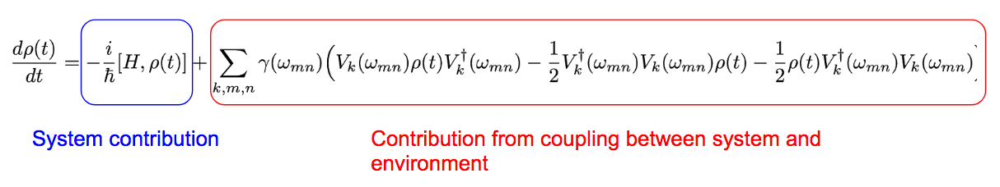
</center>

**Equation:** Redfield equation with labeled terms for evolution of system alone (blue) and interaction of system and environment (red).


Solving this form of the Redfield master equation numerically involves a number of matrix operations. Due to the summation in the second term of the differential equation, from hereon referred to as the Lindblad operator term, a naive algorithm is expected to scale as <a href="https://www.codecogs.com/eqnedit.php?latex=N^6" target="_blank"></a> with <a href="https://www.codecogs.com/eqnedit.php?latex=N^6" target="_blank"></a> the number of sites in the system.  

In addition to the interaction between the excitonic sites and the interaction between the excitonic sites and the environment we also need to model two more phenomena: the decay of excited states back to the ground state and the decay of an excited state into the target state, where charge separation takes place. Both of these effects, however, can easily be incorporated into the established formalism by adding two additional states to the density matrix, one for the molecular ground state (loss state) and one for the exciton transfer target (target state). The size of all implemented matrices is therefore always , with <a href="https://www.codecogs.com/eqnedit.php?latex=N" target="_blank"></a> excitonic states, one loss state and one target state. 


## <i class="fa fa-check-square" aria-hidden="true"></i>  Previous implementations

A number of methods has been developed for computing the exciton dynamics of open quantum systems. The Aspuru-Guzik group at the Department of Chemistry and Chemical Biology has acquired some expertise on this topic and already developed some computational methods for computing the time evolution of excited states in such complexes. However, the so far implemented methods do not scale well beyond systems with more than 30 excitonic sites.

Our goal is therefore to employ the Redfield method as a compromise of physical correctness and parallelizability to go beyond this limit and explore the space of large excited state systems over longer time scales (i.e. achieve full-scale simulations). 


## <i class="fa fa-check-square" aria-hidden="true"></i>  Approaching the problem - A naive Python implementation


To better understand the secular Redfield approximation for propagating excitonic systems under a given Hamiltonian we implemented a naive Python version of the Redfield method for two reasons: to determine computationally demanding pieces of the algorithm and design optimizations on the general algorithm structure to bypass these bottlenecks. The density matrix was updated in a simple Euler integration scheme for this purpose. With this naive implementation we were able to confirm the scaling of the method as <a href="https://www.codecogs.com/eqnedit.php?latex=N^6" target="_blank"></a> and determine the parts of the algorithm which are time consuming but suited for parallelization. 


<center>
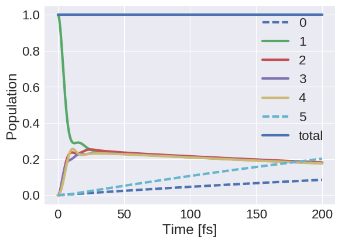
</center>

**Figure:** Population dynamics in Python with Euler integration (1 fs time step) for four excitonic sites (1 to 4), a loss state (0) and a target state (5). The sum of the population over all states is plotted as a reference (total) and remains constant during the simulation, in agreement with properties of the underlying differential equation. The excited state is quickly distributed among the four sites and then slowly decays into loss and target states. The long term behavior matches the physical expectation of thermalized excited states.


<center>
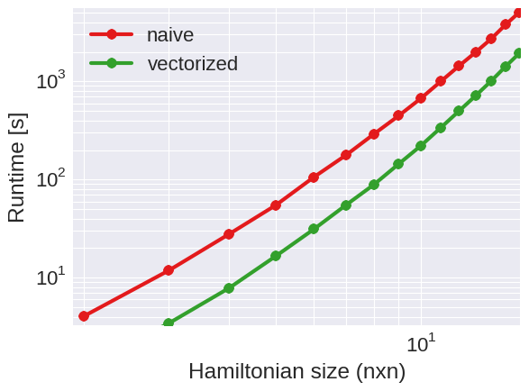
</center>

**Figure:** Runtimes of two naive Python implementations. Excitonic systems of size (n x n) were propagated for 10 integration steps with a simple Euler integration. Scalings of both, a naive Python implementation and a vectorized Python implementation, are as expected. 


In particular we found that, as suggested by the form of the equation, the computation of the density matrix update in the secular Redfield approximation can be well divided into two major contributions, the commutator with the Hamiltonian and the action of the Lindblad operator on the density matrix. 


While naively all three matrices, the Hamiltonian H, the density matrix rho and the transition matrices V are complex valued we found that the complex phase can be omitted for the Hamiltonian and the transition matrices, which allows us to implement these matrices as purely real valued. 

Furthermore, there is no reason to compute the exciton dynamics in the site bases, in which Hamiltonian and density matrix are non-diagonal. Instead, we found that as the diagonalization of the Hamiltonian is necessary anyways to compute the transition matrices, one can very well compute the time evolution of the density matrix in the eigenbasis of the Hamiltonian to further reduce the computational cost of evaluating the commutator. 

Regarding the Lindblad operator we noticed that the transition matrices are independent from current time step, which allows to compute the transition matrices at the very beginning of the propagation and store them in memory for later usage. This was also found to be true for the transition rates. 

With all these observations for implementing a faster propagation algorithm we are still left with the three dimensional sum in the Lindblad operator, which remains to be the most expensive piece of the algorithm. We therefore focus our parallelization efforts on this part of the equation. 

In addition, we encountered one major problem with the Euler integration scheme, which is a first order method. The coupling to the environment causes a dampening of oscillations in the exciton populations. However, without the Lindblad operator term in the equation, the Euler integrator cannot maintain physically reasonable populations between 0 and 1 as shown in the figure below. 


<center>

</center>

**Figure:** Population dynamics in Python with Euler integration (1 fs time step) for four excitonic sites (1 to 4), a loss state (0) and a target state (5) as before, except for zero couplings to the environment. Clearly the Euler integrator cannot maintain physically reasonable population numbers between 0 and 1, which indicates that more sophisticated integration schemes need to be employed for accurate time evolution.


## <i class="fa fa-check-square" aria-hidden="true"></i>  Advanced Feature #1: Preparations for a more efficient and more accurate implementation 


We observed that a relatively cheap Euler integration scheme is too inaccurate and we identified a number of actions we can take to optimize the algorithm. However, even with the expected improvements from the optimizations we encountered large runtimes in the Python implementation. Along with the implementation of the proposed optimization we therefore also translated the code into C to further improve runtimes. 

In the C implementation we hardcoded most of the operations to save on as many unnecessary operations as possible. The computation of the commutator, for instance, which would usually consist of two multiplications of comlex valued matrices could be reduced to two matrix vector multiplications by diagonalizing the Hamiltonian and setting the complex phase of the Hamiltonian to zero. This is demonstrated in the code listing below. 

```
for (i = 0; i < SIZE; i++) {
	for (j = 0; j < SIZE; j++) {
		comm_real[i][j] = (hamiltonian[j] - hamiltonian[i]) * rho_imag[i][j];
		comm_imag[i][j] = (hamiltonian[i] - hamiltonian[j]) * rho_real[i][j];
	}
}
```

We also precomputed the transition matrices <a href="https://www.codecogs.com/eqnedit.php?latex=V" target="_blank"></a> and implemented matrix transpose operations implictly by using the proper indexing in matrix multiplications. Furthermore we stored as many intermediate results as possible, such as the <a href="https://www.codecogs.com/eqnedit.php?latex=V^\dagger&space;V" target="_blank"></a> term in the Lindblad operator, to avoid unnecessary computations. 

However, due to the inaccurate Euler integration we were also forced to go to a 4th order Runge-Kutta integrator to maintain a reasonable level of accuracy in our calculations (4th order vs. Euler's 1st order). The 4th order Runge-Kutta integrator requires the calculation of four density matrix updated per integration step, but this additional computational cost was compensated by the implemented optimizations. The figure below shows the behavior of the 4th order Runge-Kutta integrator over time. We observe, as expected, that the peak height of the initial site is preserved during the simulation. 

<center>
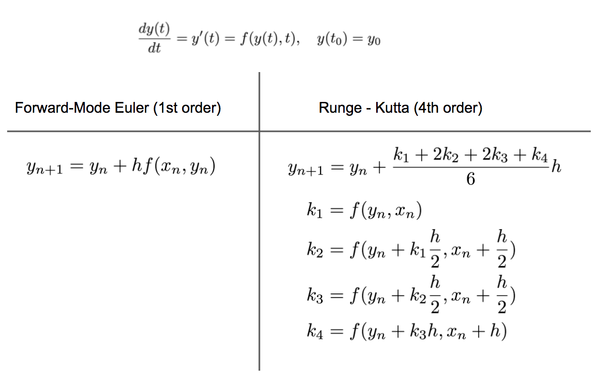
</center>

**Figure:** This table highlights the difference between the Euler and Runge-Kutta 4 methods. While easy to implement, the forward-mode Euler method used for this calculation has first order accuracy. On the other hand, the 4th order Runge Kutta takes more effort (from the programmer's point of view but also in terms of computational time and memory as these k's need to be computed and stored).


<center>
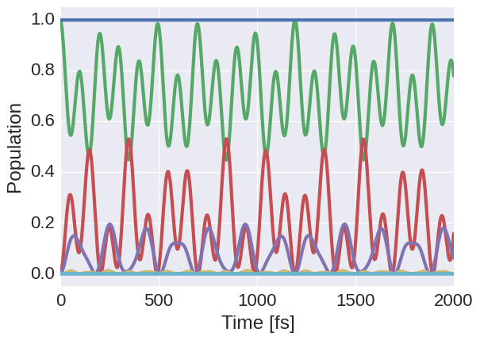
</center> 

**Figure:** Population dynamics in C with 4th order Runge-Kutta integration (1 fs time step) without coupling to the environment. We observe oscillations between the excitonic states as expected and see that the peak in the population of the initial site returns to 1 throughout the course of the simulation as opposed to the Euler integration. 

<center>
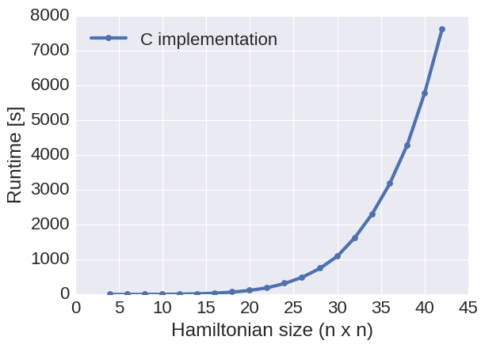
</center> 

**Figure:** Runtimes for 10 Runge-Kutta integration steps of the Redfield equations implemented in C using the features discussed above. We observe a significant performance improvement over the Python implementation. However, due to the scaling of the algorithm (<a href="https://www.codecogs.com/eqnedit.php?latex=N^6" target="_blank"></a>) we are still not able to go to larger problem sizes. 


## <i class="fa fa-check-square" aria-hidden="true"></i>  Towards an accelerated implementation: Computing Redfield in the SIMT model

Encouraged by the speedup we saw by converting the code from a not well performing Python implementation to a significantly faster C implementation we found ourselves in a situation in which we could compute exciton population dynamics for systems containing about 30 excitonic sites reasonably well.  However, to reach our stated goal of going beyond the currently accessible system size we went further and employed several parallelization schemes to accelerate the computational demanding parts of the Redfield equation. 

In a first approach we applied the SIMT execution model to our problem by parallelizing our C code with OpenACC directives for execution on a single GPU. All results presented in this section were obtained from calculations on a NVIDIA Tesla K80 GPU.

With the two separate terms of the Redfield equation in mind, the commutator of the density matrix with the Hamiltonian and the Lindblad term, observed that all quantities in the Redfield equation except for the density matrix remain unchanged during all propagation steps. 

<center>

</center>

**Equation** Density matrix master equation for open quantum systems in the secular Redfield approximation. 

To achieve high speedups compared to a serial implementation and use the GPU efficiently we therefore tried to keep the communication between the CPU and the GPU at the minimum and make use of the 12 GB memory on the Tesla K80 GPUs. 

With this amount of memory on the device we were able to precompute all constant quantities in the Redfield equations before starting the propagation, copy them onto the GPU and leave them there for the entire computation. In particular, we performed the following computations on the CPU before starting to propagate on the GPU: 

* Diagonalize the Hamiltonian using Lapack and store eigenvalues and eigenvectors
* Compute transition rates <a href="https://www.codecogs.com/eqnedit.php?latex=\gamma" target="_blank"></a> on the CPU from parameters provided by the user. The transition rates depend on three different indices, m, M and N, and were all stored in a three dimensional tensore of size (n+2) x (n+2) x (n+2) with n denoting the number of excitonic sites in the system. 
* Compute the transition matrices V on the CPU. The transition matrices V depend on two indices, M and N, running over the number of excitonic sites in the system and can be obtained from the eigenvectors of the Hamiltonian. Transition matrices were stored in a four dimensional tensor

Both, Hamiltonian and transition matrices could be stored as real matrices due to the phase ambiguity in the equation. Transpose operations were implemented implicitly by using the proper indexing in matrix multiplications. 

As the commutator in the Redfield equation scales as <a href="https://www.codecogs.com/eqnedit.php?latex=N^4" target="_blank"></a> and the Lindblad term scales as <a href="https://www.codecogs.com/eqnedit.php?latex=N^6" target="_blank"></a> we decided to compute the contributions of these two terms to the change in the density matrix sequentially, to optimally use the GPU for the computation of the Lindblad term. Nevertheless, we parallelized both of these terms, as well as the individual steps of the Runge-Kutta integration. 

All operations in the code were parallelized on the gang (thread block), worker (warp) and vector (thread) level. We implemented blocked matrix operations to use the fast memory of the GPU. The blocked instructions for computing the commutator are shown below.

```
#pragma acc kernels present(hamiltonian[0:N]) present(comm_real[0:N][0:N], comm_imag[0:N][0:N]) present(rho_real[0:N][0:N], rho_imag[0:N][0:N])
#pragma acc loop independent collapse(2)
for (ii = 0; ii < N; ii += BLOCK_SIZE)
    for(jj = 0; jj < N; jj += BLOCK_SIZE) {
        #pragma acc loop independent collapse(2)
        for (i = 0; i < BLOCK_SIZE; i++) {
	        for (j = 0; j < BLOCK_SIZE; j++) {
	            index = ii + i;
	            jndex = jj + j;
	            if (index < N && jndex < N) {
	                comm_real[index][jndex] = (hamiltonian[jndex] - hamiltonian[index]) * rho_imag[index][jndex];
	                comm_imag[index][jndex] = (hamiltonian[index] - hamiltonian[jndex]) * rho_real[index][jndex];
	            }
	        }
        }
    }
}
```
We started our tests with block sizes of 16x16, which is reported to perform best on this GPU. For this block size, we set up a maximum number of 256 vectors which executed the loops within one block, and a total of 4 workers, to parallelize over different blocks. However, we then found for our problem sizes with moderately large matrices that we could improve performance by using block sizes of 8x8 on 64 vectors with 16 workers instead.

As expected, we saw the best performance improvement after parallizing the Lindblad term. Due to the highly nested for loops necessary for computing the Lindblad contribution to the change in the density matrix we were not able to parallelize all of the for loops for this calculation. With six nested for loops in total, three stated explicitly in the equation and three additional for matrix operations in the Lindblad operator, this term exceeds the number of levels of parallelization available on the GPU. 

To still use the GPU as efficient as possible, we decided to split the Lindblad term as 

<a href="https://www.codecogs.com/eqnedit.php?latex=\sum\limits_{m,M}&space;\sum\limits_{N}&space;\gamma(\omega_{MN})&space;\left(&space;V_m(\omega_{MN})&space;\rho(t)&space;V^\dagger_m(\omega_{MN})&space;-&space;\frac{1}{2}&space;V_m^\dagger(\omega_{MN})&space;V_m(\omega_{MN})&space;\rho(t)&space;-&space;\frac{1}{2}&space;\rho(t)&space;V^\dagger_m(\omega_{MN})&space;V_m(\omega_{MN})&space;\right&space;)" target="_blank"></a>

and parallelize the summation over <a href="https://www.codecogs.com/eqnedit.php?latex=N" target="_blank"></a> on the gang (thread block) level and the two outer loops for matrix multiplications (one over blocks and another within blocks) on the worker and vector level (please see liouville.c for details). The number of thread blocks was hereby set equal to the number of excitonic sites in the system. 

Parallelization of these sums yields the advantage that we keep a maximum number of threads busy for a maximum time. Each individual thread performs a single reduction in a matrix multiplication, due to which all threads share about the same work load and finish in about the same time. Assigning an entire reduction to a single thread was found to significantly improve performance as opposed to a scheme in which individual matrix operations are parallelized on the gang, worker and vector level and all three explicit sums in the Lindblad term are carried out sequentially. 

Race conditions in this parallelization scheme were avoided by explicitly creating <a href="https://www.codecogs.com/eqnedit.php?latex=N" target="_blank"></a> copies of the transition matrices as well as all matrices which store intermediate results of the Lindblad operator computation. 


We observe a significant improvement of runtimes with this parallelization scheme over the serial implementation of the code. 

<center>

</center> 

**Figure:** Runtimes of 10 iterations in the Runge-Kutta integration scheme (1 fs time step) for excitonic systems of different sizes. Displayed are runtimes for the serial C implementation and the SIMT model with OpenACC directives on the C code. Simulations were run on a NVIDIA Tesla K80 GPU. Due to the computational demand of serial simulations fewer points are shown, indicating that the parallization allows us to go to larger problem sizes in reasonable time. 


As displayed in the benchmark plot above we achieve significantly smaller runtimes with the parallelized code, which allows us to compute the population dynamics in much larger excitonic systems. The achieved speedups with the GPU over the serial implementation on the CPU are shown in the plot below.

<center>

</center> 

**Figure:** Speedups for 10 iterations in the Runge-Kutta integration scheme (1 fs time step) for excitonic systems of different sizes. We compared runtimes of the serial C implementation to the OpenACC parallelized implementation. Speedups could only be computed for problem sizes for which serial runtimes were available. Due to the FLOPs per second graph recorded for the GPU and the rather constant FLOPs per second for the CPU it is expected that we can achieve speedups up to roughly a factor of 100 for larger problem sizes (resulting in about 5 days of runtime for 10 iterations of 80 x 80 matrices on a single CPU).

Unfortunately we quickly ran into large simulation times for the serial implementation, which did not allow us to compute the speedups directly for even larger matrices. Running a ten propagation steps (40 density matrix updates) on a single CPU for 40 excitonic sites already took about three hours with a consistent scaling of <a href="https://www.codecogs.com/eqnedit.php?latex=N^4" target="_blank"></a>. Indeed, the GPU allowed us to go beyond what is accessible with just a CPU. The throughput we achieved on the GPU for different problem sizes is shown below. 

<center>

</center> 

**Figure:** Lower bound on the throughput of the GPU. A single NVIDIA Tesla K80 is expected to achieve a maximum 0.9 TFLOPS throughput. The lower bound on the throughput was calculated by counting the number of additions and multiplications to be performed during the computation. 


From the throughput plot we observe that we do not use the GPU efficiently for small matrices (< 20x20) but seem to reach our maximum throughput for this implementation for matrices of size 60x60 and larger. We see the reason in the low throughput for small matrices simply in the fact that the algorithm does not contain as many parallelizable operations for small problem sizes as for large problem sizes. 

With a blocking size of 8x8 we can already fill up a warp with a 6x6 density matrix. However, the other available warps on the GPU cannot be utilized for other computations while the density matrix update is calculated, which results in the relatively low throughput. With our blocking scheme we can already use 16 warps with 64 threads each at a problem size of 30x30. The throughput still increases beyond this problem size due to the use of multiple threadblocks, until we fill up the GPU as far as possible with the current implementation. 

The parallel implementation of the Redfield equation now allows us to study large excitonic systems in a reasonable amount of time. The figure below displays the population dynamics of a 16 site system calculated on a GPU in not even 5 % of the runtime on a CPU. 


<center>

</center> 


**Figure:** Population dynamics computed with the OpenACC parallelized C code for 16 excitonic sites (matrices of size 18 x 18) for 1000 integration steps in a 4th order Runge Kutta integration. The simulation was run for 164 s on a Tesla K80 GPU. The same population dynamics plot could be obtained after about 1 h on a CPU. 

The comparison in runtimes for the serial and GPU implementation of the Redfield equation for the 16 site system is shown below. While the speedup achieved at these problem sizes now allows for high-throughout scans of excitonic systems in the vicinity of actual biological complexes, the even larger speed up for larger problems sizes enables us to study systems beyond natural occurring systems. 

<center>
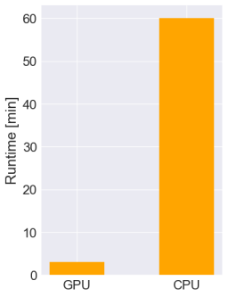
</center>

**Figure:** Comparison of runtimes for a 16 site system for 1000 Runge Kutta integration steps on a Tesla K80 GPU and a single CPU. 


## <i class="fa fa-check-square" aria-hidden="true"></i>  Advanced Feature #2: Stronger Scaling via OpenMP

As observed from previous implementions, the bottleneck of the calculation was in the matrix-matrix multiplication operations in the Lindblad term of the Redfield equation (the red portion of the equation shown above). Thus, optimizing these matrix operations was expected to help reduce the runtimes and improve scalability. 

Focusing on a single matrix-matrix multiplication, we implemented the operation using blocking, shown to be robust for large matrix sizes, and OpenMP which supports shared memory multiprocessing programming. Below is the code listing for the blocked matrix-matrix multiplication implementation:

```
#pragma omp parallel for shared(A,B,C) private(i, j, ii, jj, k) schedule(auto) collapse(2) num_threads(8)
for (i = 0; i < SIZE; i += BLOCK_SIZE) {
	for (j = 0; j < SIZE; j += BLOCK_SIZE) {
		for (ii = 0; ii < BLOCK_SIZE; ii += 1) {
                	for (jj = 0; jj < BLOCK_SIZE; jj += 1) {
                        	index = ii + i;
                                jndex = jj + j;
                                if (index < SIZE && jndex < SIZE) {
                                	temp = 0.;
                                        for (k = 0; k < SIZE; k++) {
                                        	temp += A[index][k] * B[k][jndex];
                                        }
                                        C[index][jndex] = temp;
                                }
              		}
        	}	
	}
}
```

Using OpenMP, we "collapsed" or unrolled the two outer loops and tested different numbers of threads to work on portions of the overall operation. In addition, various Hamiltonian sizes were considered to determine the conditions that would give us the best performance for large system sizes and long time scales.


<center>
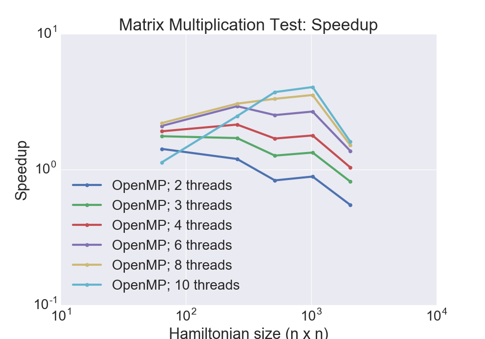
</center>

**Figure:** Speedups of matrix-matrix multiplication using multiple threads. We can see that the use of more threads is better justified for larger system sizes.


<center>
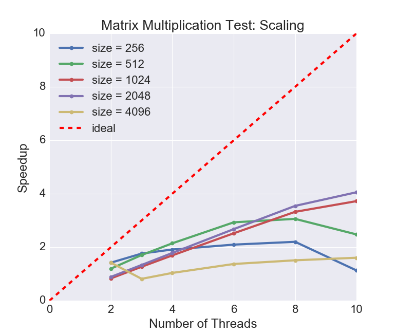
</center>

**Figure:** Scaling of matrix-matrix multiplication using multiple threads. Though not very close to the ideal curve, generally, adding more threads led to better scaling.


Generally, we noted that using a greater number of threads led to faster runtimes and better scaling. However, simply adding more threads did not lead to favorable performance due to overheads. Therefore, one must check that the matrix size is large enough such that the use of more threads is effective.


For a more thorough investigation, we decided to take the OpenMP directives from the single matrix-matrix multiplication implementation and run a single iteration of the Lindblad term (again, recall that this is the second term of the Redfield equations that involve many matrix operations). This single iteration still involved 15*N^3 matrix-matrix multiplication operations, and we hoped to observe significant speedups using OpenMP and blocking.

<center>
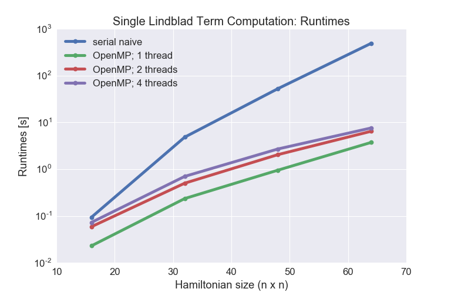
</center>

**Figure:** Runtimes [s] from a single iteration of the Lindblad term. 

<center>
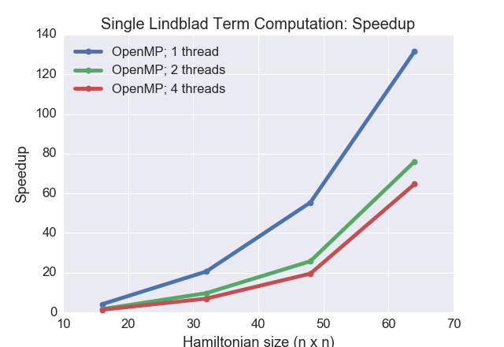
</center>

**Figure:** Speedups from using OpenMP and blocking.

Based on running calculations for matrix sizes 16, 32, 48, and 64, we already see significant speedups (up to ~120x) using OpenMP and blocking. We believe much of the speedups we observe are from the blocking implementation as these matrix sizes are too small to benefit from multithreading. According to the speedup plots, using more threads led to speedups but these were less than the speedups observed when using fewer threads.


## <i class="fa fa-check-square" aria-hidden="true"></i>  Hybrid implementation: MPI and OpenAcc

Finally, we explored a hybrid implementation to increase the speed up on the OpenAcc optimized version is using MPI, and to reach the computation of bigger matrices. In a first implementation, we opted to use 2 nodes with 1 core and 1 GPU each, to gain some intuition about the technical challenges of programming and compiling MPI and OpenAcc. The goal of this approach is to compute on a different GPU to compute a term on the Lindblad equation by parallelizing the computation of the different terms of the first summation (sum over m) on different GPUs and by reducing and updating the status of this term using MPI and OpenAcc.

<a href="https://www.codecogs.com/eqnedit.php?latex=\sum\limits_{m}\sum\limits_{N,M}&space;\gamma(\omega_{MN})&space;\left(&space;V_m(\omega_{MN})&space;\rho(t)&space;V^\dagger_m(\omega_{MN})&space;-&space;\frac{1}{2}&space;V_m^\dagger(\omega_{MN})&space;V_m(\omega_{MN})&space;\rho(t)&space;-&space;\frac{1}{2}&space;\rho(t)&space;V^\dagger_m(\omega_{MN})&space;V_m(\omega_{MN})&space;\right&space;)" target="_blank"></a>

In this implementation, we need to make sure that the matrices use contiguous sections in memory,
therefore we required to change the way the matrices are allocated:
```
double ***alloc_3d_double(int rows, int cols, int dept) {
    double *data = (double *)malloc(rows*cols*dept*sizeof(double));
    double **array= (double **)malloc(rows*dept*sizeof(double*));
    double *** tensor = (double ***)malloc(dept*sizeof(double**));
    for (int i=0; i<dept; i++){
	tensor[i] = &(array[rows*i]);
    	for (int j=0; j<rows; j++){
        	tensor[i][j] = &(data[(rows*cols*i)+cols*j]);
	}
    }

    return tensor;
}
```
Finally, after the computation of part of the summation of the Lindblad's term in a GPU using OpenACC, 
these matrices are copied on their respective CPU and added and updated using
the MPI function ```MPI_Allreduce```.

```
#pragma acc data copyout(lindblad_real[0:SIZE][0:SIZE])
MPI_Allreduce(MPI_IN_PLACE, &(lindblad_real[0][0]),SIZE*SIZE, MPI_DOUBLE, MPI_SUM, MPI_COMM_WORLD);
#pragma acc update device(lindblad_real[0:SIZE][0:SIZE])
```
We expect some overheads on the computation
due to this step and speed ups up to the numbers of GPUs we use. 

The main potential advantage of using more GPUs is memory that we will require in each of them, because we can copy from the CPU host to the device,
just sections of the most memory intensive variables, the V matrices stored in a tensor of rank 3 (<a href="https://www.codecogs.com/eqnedit.php?latex=N^6" target="_blank"></a>) and two precomputed matrices of the same size. 


## <i class="fa fa-check-square" aria-hidden="true"></i>  Conclusion

We were able to implement and parallelize the Redfield equations using various methods including algorithm optimization, use of low-level language, and uses of various parallelization models. Currently, our Redfield code can work well for relatively small Hamiltonian sizes, but further optimizations including effective use of OpenMP for stronger scaling may eventually allow us to run the entire calculation for much larger systems for longer time scales.


## <i class="fa fa-check-square" aria-hidden="true"></i>  References
[1] P. Rebentrost, R. Chakraborty, and A. Aspuru-Guzik, *J. Chem. Phys.*, **131**, 184102 (2009).

[2] P., M. Mohseni, I. Kassal, S. Lloyd, and A. Aspuru-Guzik, *New Journal of Physics*, **11**, 033003 (2009).

[3] V. May and O. Kühn, *Charge and Energy Transfer Dynamics in Molecular Systems*, Wiley, New York, 2004. 

[4] H. P. Breuer, and F. Petruccione, *The theory of open quantum systems*, Oxford, New York, 2010.

[5] I. Kondov, U. Kleinekathöfer, and M. Schreiber, *J. Chem. Phys.*,  **114**, 1497 (2001).

[6] C. Kreisbeck and T. Kramer, *J. Phys. Chem.* **3**, 2828, (2011).

[7] C. Kreisbeck and T. Kramer "Exciton Dynamics Lab for Light-Harvesting Complexes (GPU-HEOM)," https://nanohub.org/resources/gpuheompop, (DOI: 10.4231/D3QB9V630), (2014).
