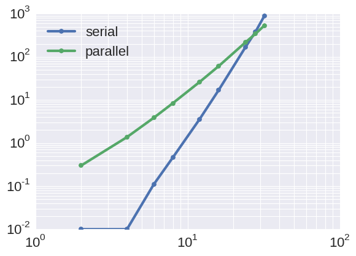

# CS205 Final project
# Implementation and parallelization of Redfield equations

Florian Hase, Hannah Sim, and Teresa Tamayo

In this project, we are going to implement and parallelize a 
method for computing the time evolution of the density matrix in an open quantum, 
the Redfield method. This method applies to some photosynthetically active protein complexes[1,2]. 

<center>

</center>

**Figure:** The Fenna-Matthews-Olson (FMO) complex.
Protein from green sulfur bacteria and involved in
the excitation energy transfer from light-harvesting chlorosomes.

The FMO complex contains a total of 24 excitonic sites (bacteriochlorophyll A molecules) in three weakly coupled subunits. However, the FMO complex is only one particular protein complex of the photosystem of green sulfur bacteria. Entire photosystems of different organisms typically contain ~40 up to ~100 excitonic sites. Thus, in order to learn about exciton movements within photosystems a powerful algorithm for computing the exciton population in such large systems is needed. 


The Theoretical and Physical Chemistry group of Prof. Alan Aspuru-Guzik, 
has wide experience in the field, where they have studied the
exciton energy transfer in diverse systems.


## <i class="fa fa-check-square" aria-hidden="true"></i> Redfield method

The evolution of small systems is usually influenced by the interaction of the surroundings, 
given that in general is impossible to isolate it. Hence, the dynamics of a quantum system depends 
substantially on the interaction of the external environment. 
However, we are usually unable to keep track the evolution of the complete systems and their surroundings. 
In this situation, we use equations that account the influence of the surroundings on the systems, 
but not keeping track the environment evolutions. 
These ubiquitous phenomena determine the physics and chemistry in diverse fields, one of the most important is the exciton transfer dynamics[1],
One way to describe these dynamics is to utilize the Redfield master equations, where we assume that the transport is a dissipative dynamics for the reduced excitonic density matrix[3,4]. This model considers the interactions between the environment and the system weak and that the system depends only on its present state. In the Redfield approximation, the relaxation time scale on which the environment interacts with the excitonic system is assumed to be large compared to the coherence time scale of the excitonic system itself. While only under this assumption the Redfield approximation yields the correct dynamics it will always generate the correct thermalized states. However, if the assumption is violated, the Redfield method may predict unphysical negative exciton populations. 


The density matrix of the excitonic system can be time evolved according to the Liouville-von Neumann equation:


The first term takes into account the evolution of the system without the presence of the environment, while the second keeps track on the environmental influence of the system [3,4].  Here, the Lindblad operator *D(V)* can be written as 


with matrices *V* given as 


The differential equation for the density matrix can be solved iteratively by calculating the change in the density matrix for a small time step *dt*. For computing the change in the density matrix not only the commutator of the density matrix with the system Hamiltonian has to be calculated, but also the action of the Lindblad operator *D(V)* on the density matrix. 

With all operators represented as matrices, this computation involves a number of matrix matrix multiplications but also the evaluation of the sum in the second term of the differential equation, which goes over all excitonic states in the system three times. 

Computing the time evolution of an excitonic system is therefore computationally demanding and expected to scale naively to the sixth power with the number of excitonic sites in the system. 


## <i class="fa fa-check-square" aria-hidden="true"></i>  Previous implementations

There is a number of methods for computing the dynamics of an excitonic system, some of which follow the Redfield approximation. 

One straightforward implementation is build and diagonalize the Liouville superoperator, and if we use a time-independent Hamiltonian the computational demand scales as <a href="https://www.codecogs.com/eqnedit.php?latex=N^6" target="_blank"></a> where <a href="https://www.codecogs.com/eqnedit.php?latex=N^6" target="_blank"></a> denotes the number of excitonic sites in the system. 

The most time expensive part of the calculation is hereby the computation of the Lindblad operator acting on the density matrix, which model the transition between excitonic states in the system mediated by the environment. But the overall scaling of the method can be reduced by combining particular parts of the computation [5].


## <i class="fa fa-check-square" aria-hidden="true"></i>  Methodology
Our first approach will be implement a serial version of the
solver with a variety of numerical implementations to
perform the time propagations, including different numbers 
of vibrational states in the bath.
Later, we explore different parallelization schemes
with hybrid architectures.
Finally, we will compare our results with an state-of-the-art 
implementation of hierarchical equations of motion [6,7].


## <i class="fa fa-check-square" aria-hidden="true"></i>  Python implementations

To understand the secular Redfield approximation for propagating excitons under a given Hamiltonian in more detail we implemented a Python version of the Redfield method. With this implementation we were able to identify the scaling of the method and determine parts of the algorithm which are time consuming but suited for parallelization. 

In particular, we found that the secular Redfield approximation can be devided into two major parts. The Lindblad operator *L* contains a set of rates which model the transition of a particular excitonic state into another excitonic state or the decay of the excitonic state into the ground state or the target state. These rates are calculated based on the excitonic eigenstates of the Hamiltonian and the spectral density, for which parameters are expected from the user. 

<center>

</center>

**Figure:** Population dynamics for a two site excitonic system computed with a vectorized Python implementation. 


<center>

</center>

**Figure:** Population dynamics for an eight site excitonic system computed with a vectorized Python implementation. 

Although computing the rates involves a number of matrix operations (diagonalizing the Hamiltonian, matrix multiplications, etc.) this is not the time limiting step for computing the exciton dynamics because rates can be calculated once at the beginning of the simulation. 

Instead, we found that we should focus our parallelization strategies on the propagation of the density matrix for precomputed Hamiltonians and Lindblad operator matrices. Propagating the system in the excitonic eigenbasis yields the additional advantage of the Hamiltonian being diagonalized, which simplifies the computation of the commutator of the Hamiltonian and the density matrix (we save one matrix multiplication). 

However, the action of the Lindblad operator on the density matrix needs to be calculated at every iteration step. Even with precomputed Lindblad operator matrices, this operation requires at least four matrix multiplications, which is reflected in the scaling plots we obtained for the Python implementation of the code. We expect the algorithm to greatly benefit from a parallelization of this operation. 

<center>

</center>

We found that both implementations of the secular Redfield method show a scaling of roughly *N<sup>3.5</sub>* with *N* denoting the number of excitonic sites in the system.


##<i class="fa fa-check-square" aria-hidden="true"></i>  C implementations

Although we could achieve significantly better scaling in our Python implementation compared to a naive implementation of the Redfield method the runtimes are still not satisfying for computing the exciton population dynamics for biologically relevant complexes. We therefore implemented the algorithm in C, to achieve faster computation of larger systems. 

While for the Python implementation we relied on matrix operations taken from the numpy package we now further accelerated computations by carefully implementing calculations in the algorithm and using mathematical properties of quantities in the equation. 

For instance, we used the fact that the system Hamiltonian can be diagonalized and always contains real values, such that we can implement the calculation of the commutator with the density matrix in a doubly nested for loop instead of a triply nested for loop. Preprocessing some of the algebra in the computation allowed us to compute this commutator with only two additions and four multiplications in each execution of the doubly nested for loop for the real and the imaginary part of the density matrix. The pseudo-code for the computation of the commutator is listed below.

```C
for (i = 0; i < N; i++) 
	for (j = 0: j < N; j++) 
		real_part[i, j] = hbar_inv * (ham[j] - ham[i]) * rho_imag[i, j]
		imag_part[i, j] = hbar_inv * (ham[i] - ham[j]) * rho_real[i, j]
```

Such simplifications were further employed at other parts in the algorithm. The eigenvectors of the hamiltonian, for instance, are orthogonal. Thus, we can calculate the inverse of the eigenvector matrix by just transposing it. The transpose operation was never implemented explicitly in the code. Instead, we always used the proper indexing of arrays to account for transposed matrices in the computations. 

From the Python implementation we also learned that a simple Euler integration step is too inaccurate. The integration algorithm should conserve the total population across all excitonic states, as it is preserved by the physical equations. However, we observed that this is not the case for simple Euler integration.

To improve our integration method we implemented a fourth order Runge-Kutta scheme as a compromise between accuracy and computational demand. With an integration time step of 1 fs we expect to be running time propagations for about 10000 steps, for which we observed well preserved total populations for small systems 

<center>

</center>

**Figure:** Test simulation of Runge Kutta integration. We observe well preserved total population over 10000 integration steps.

With the C implementation of the Redfield method we achieved significantly faster runtimes. However, we did not improve on the scaling.

By profiling the code we realized that most of the time is spent on computing the second term of the Liouville equation, which is expected due to the additional multi-sum over the excitonic states in the system. 


##<i class="fa fa-check-square" aria-hidden="true"></i>  OpenACC parallelizations

Still not happy with the overall runtimes and scaling we started parallelizing the code implicitly to run it on a GPU and speed up in particular the computation of the second term in the Liouville equation, which contains the Lindblad operator. 

The only quantity of interest in the computation of the time evolution is the density matrix. Any intermediate result of any other quantity can be discarged during the computation. Hence, we can precompute all quantities needed for the time propagation (transition rates, transition matrices, etc.), transfer all quantities on the GPU and compute the time propagation entirely on the GPU. Density matrices only need to be copied back to the host CPU after every full integration step (four Runge-Kutta updates). We therefore expect to obtain better scaling with the parallelization capabilities of the GPU.

We use OpenACC and the PGI compiler to transfer parts of our code to the GPU. 

<center>


</center>

**Figure:** Population dynamics for an eight site excitonic system computed with a vectorized Python implementation. 


## <i class="fa fa-check-square" aria-hidden="true"></i>  References
[1] P. Rebentrost, R. Chakraborty, and A. Aspuru-Guzik, *J. Chem. Phys.*, **131**, 184102 (2009).

[2] P., M. Mohseni, I. Kassal, S. Lloyd, and A. Aspuru-Guzik, *New Journal of Physics*, **11**, 033003 (2009).

[3] V. May and O. Kühn, *Charge and Energy Transfer Dynamics in Molecular Systems*, Wiley, New York, 2004. 

[4] H. P. Breuer, and F. Petruccione, *The theory of open quantum systems*, Oxford, New York, 2010.

[5] I. Kondov, U. Kleinekathöfer, and M. Schreiber, *J. Chem. Phys.*,  **114**, 1497 (2001).

[6] C. Kreisbeck and T. Kramer, *J. Phys. Chem.* **3**, 2828, (2011).

[7] C. Kreisbeck and T. Kramer "Exciton Dynamics Lab for Light-Harvesting Complexes (GPU-HEOM)," https://nanohub.org/resources/gpuheompop, (DOI: 10.4231/D3QB9V630), (2014).
