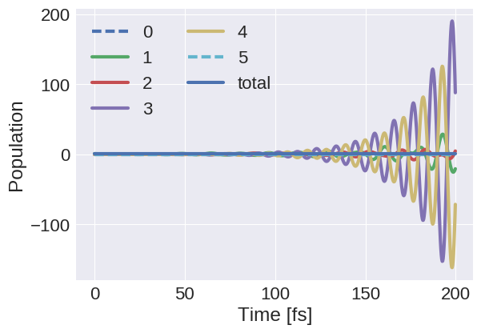
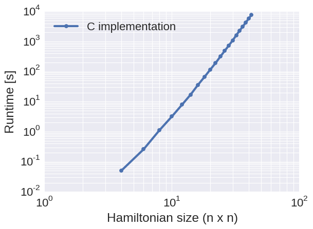

# CS205 Final project
# Implementation and parallelization of the secular Redfield equations

Florian Hase, Hannah Sim, and Teresa Tamayo

The critical process of energy harvesting in solar cells is to quickly convert excited states generated by photon absorption into separated charge carriers for long term energy storage. Nature has developed highly efficient and fast complexes which mediate the transfer of excited state energies from the light harvesting molecules, which absorb photons, to the location where the harvested energy is used to initiate a cascade of chemical reactions. These complexes are collectively referred to as Light-harvesting complexes.


<center>

</center> 


**Figure:** Cartoon and stick representation of the Fenna-Matthews-Olson (FMO) complex. The FMO complex is a photosynthetically active protein complex in green sulfur bacteria consisting of three subunits with eight bacteriochlorophylls each. Highly efficient excited state transfer is mediated by this pigment-protein complex due to the close-to-optimal geometrical arrangment of the bacteriochlorophyll molecules within the protein shell. 

Understanding the energy transfer in photosynthesis from the absorption of the photon to the charge separation is crucial for improving the efficiency of solar cells. However, experimental techniques for measuring the transfer of excited states are limited due to short time scales and tight packing of excitation sites. 

Nevertheless the dynamics of excited states in protein complexes has been studied extensively in computer simulations. Several theoretical models at different levels exist to describe the exciton dynamics but even the simplest suitable models can only be applied to a relatively small number of excitonic sites (< 30) due to the computational scaling of the algorithms with the number of excitonic sites in the considered system. 

In this project we focus on an implementation of the secular Redfield equation for exciton transfer and parallelize this method for computing the time evolution of an open quantum system. Using sophisticated programming models and combining them in hybrid implementations we hope to ease the curse of scalability for this particular problem and reach complex sizes beyond the currently accessible. 


## <i class="fa fa-check-square" aria-hidden="true"></i> Redfield method

The dynamics of excited states can be described in terms of the time evolution of a density matrix $\rho(t)$. The time evolution of excited states is hereby not only influenced by interaction among the excited states in the system but also by interactions between the system and the environment, commonly referred to as the bath. Due to the large number of degrees of freedom the interactions between system and bath cannot be treated explicitly in a quantum mechanical framework. However, the effect of the bath on the system can be modeled implicitly by accounting for environmental influences in a generalized Liouville-von Neumann equation. 

The Redfield approximation furthermore assumes a weak coupling between the system and the bath. With the additional approximation that only certain resonant modes couple between the system and the bath we can then finally write a master equation for excited state energy time evolution in the form of a Lindblad equation. 

Considering a system with $N$ sites and a Hamiltonian $H$, the time evolution of the density matrix $\rho(t)$ in the Redfield master equation is defined as 

$$
\frac{d\rho(t)}{dt} = - \frac{i}{\hbar} \left[ H, \rho(t) \right] + \sum\limits_{m,M,N} \gamma(\omega_{MN}) \left( V_m(\omega_{MN}) \rho(t) V^\dagger_m(\omega_{MN}) - \frac{1}{2} V_m^\dagger(\omega_{MN}) V_m(\omega_{MN}) \rho(t) - \frac{1}{2} \rho(t) V^\dagger_m(\omega_{MN}) V_m(\omega_{MN}) \right )
$$

where $\gamma$ denotes transition rates between the excitonic states in the system and $V$ are transition matrices defined as

$$
V_m(\omega) = \sum\limits_{\omega, M, N} c^*_m(M) c_m(N) |M \rangle \langle N | \delta(\omega\hbar - E_M + E_N)
$$

The first term of the differential equation for the density matrix accounts for the time evolution of the excitonic system alone while the second term is used to compute the influence of the environment on the dynamics of the excitonic system. 

Solving this form of the Redfield master equation numerically involves a number of matrix operations. Due to the summation in the second term of the differential equation, from hereon referred to as the Lindblad operator term, a naive algorithm is expected to scale as <a href="https://www.codecogs.com/eqnedit.php?latex=N^6" target="_blank"></a> with <a href="https://www.codecogs.com/eqnedit.php?latex=N^6" target="_blank"></a> the number of sites in the system.  

In addition to the interaction between the excitonic sites and the interaction between the excitonic sites and the environment we also need to model two more phenomena: the decay of excited states back to the ground state and the decay of an excited state into the target state, where charge separation takes place. Both of these effects, however, can easily be incorporated into the established formalism by adding two additional states to the density matrix, one for the molecular ground state (loss state) and one for the exciton transfer target (target state). The size of all implemented matrices is therefore always $N + 2$, with $N$ excitonic states, one loss state and one target state. 


## <i class="fa fa-check-square" aria-hidden="true"></i>  Previous implementations

A number of methods has been developed for computing the exciton dynamics of open quantum systems. The Aspuru-Guzik group at the Department of Chemistry and Chemical Biology has acquired some expertise on this topic and already developed some computational methods for computing the time evolution of excited states in such complexes. However, the so far implemented methods do not scale well beyond systems with more than 30 excitonic sites.

Our goal is therefore to employ the Redfield method as a compromise of physical correctness and parallelizability to go beyond this limit and explore the space of large excited state systems. 


## <i class="fa fa-check-square" aria-hidden="true"></i>  Approaching the problem - A naive Python implementation


To better understand the secular Redfield approximation for propagating excitonic systems under a given Hamiltonian we implemented a naive Python version of the Redfield method for two reasons: to determine computationally demanding pieces of the algorithm and design optimizations on the general algorithm structure to bypass these bottlenecks. The density matrix was updated in a simple Euler integration scheme for this purpose. With this naive implementation we were able to confirm the scaling of the method as $N^6$ and determine the parts of the algorithm which are time consuming but suited for parallelization. 


<center>

</center>

**Figure:** Population dynamics in Python with Euler integration (1 fs time step) for four excitonic sites (1 to 4), a loss state (0) and a target state (5). The sum of the population over all states is plotted as a reference (total) and remains constant during the simulation, in agreement with properties of the underlying differential equation. The excited state is quickly distributed among the four sites and then slowly decays into loss and target states. The long term behavior matches the physical expectation of thermalized excited states.


<center>

</center>

**Figure:** Runtimes of two naive Python implementations. Excitonic systems of size (n x n) were propagated for 10 integration steps with a simple Euler integration. Scalings of both, a naive Python implementation and a vectorized Python implementation, are as expected. 


In particular we found that, as suggested by the form of the equation, the computation of the density matrix update in the secular Redfield approximation can be well divided into two major contributions, the commutator with the Hamiltonian and the action of the Lindblad operator on the density matrix. 

While naively all three matrices, the Hamiltonian H, the density matrix rho and the transition matrices V are complex valued we found that the complex phase can be omitted for the Hamiltonian and the transition matrices, which allows us to implement these matrices as purely real valued. 

Furthermore, there is no reason to compute the exciton dynamics in the site bases, in which Hamiltonian and density matrix are non-diagonal. Instead, we found that as the diagonalization of the Hamiltonian is necessary anyways to compute the transition matrices, one can very well compute the time evolution of the density matrix in the eigenbasis of the Hamiltonian to further reduce the computational cost of evaluating the commutator. 

Regarding the Lindblad operator we noticed that the transition matrices are independent from current time step, which allows to compute the transition matrices at the very beginning of the propagation and store them in memory for later usage. This was also found to be true for the transition rates. 

With all these observations for implementing a faster propagation algorithm we are still left with the three dimensional sum in the Lindblad operator, which remains to be the most expensive piece of the algorithm. We therefore focus our parallelization efforts on this part of the equation. 

In addition, we encountered one major problem with the Euler integration scheme. The coupling to the environment causes a dampening of oscillations in the exciton populations. However, without the Lindblad operator term in the equation, the Euler integrator cannot maintain physically reasonable populations between 0 and 1 as shown in the figure below. 


<center>

</center>

**Figure:** Population dynamics in Python with Euler integration (1 fs time step) for four excitonic sites (1 to 4), a loss state (0) and a target state (5) as before, except for zero couplings to the environment. Clearly the Euler integrator cannot maintain physically reasonable population numbers between 0 and 1, which indicates that more sophisticated integration schemes need to be employed for accurate time evolution.


## <i class="fa fa-check-square" aria-hidden="true"></i>  Preparations for a more efficient and more accurate implementation 


We observed that a relatively cheap Euler integration scheme is too inaccurate and we identified a number of actions we can take to optimize the algorithm. However, even with the expected improvements from the optimizations we encountered large runtimes in the Python implementation. Along with the implementation of the proposed optimization we therefore also translated the code into C to further improve runtimes. 

In the C implementation we hardcoded most of the operations to save on as many unnecessary operations as possible. The computation of the commutator, for instance, which would usually consist of two multiplications of comlex valued matrices could be reduced to two matrix vector multiplications by diagonalizing the Hamiltonian and setting the complex phase of the Hamiltonian to zero. This is demonstrated in the code listing below. 

```
for (i = 0; i < SIZE; i++)
	for (j = 0; j < SIZE; j++) {
		comm_real[i][j] = (hamiltonian[j] - hamiltonian[i]) * rho_imag[i][j];
		comm_imag[i][j] = (hamiltonian[i] - hamiltonian[j]) * rho_real[i][j];
	}
```

We also precomputed the transition matrices $V$ and implemented matrix transpose operations implictly by using the proper indexing in matrix multiplications. Furthermore we stored as many intermediate results as possible, such as the $V^\dagger V$ term in the Lindblad operator, to avoid unnecessary computations. 

However, due to the inaccurate Euler integration we were also forced to go to a 4th order Runge-Kutta integrator to maintain a reasonable level of accuracy in our calculations. The 4th order Runge-Kutta integrator requires the calculation of four density matrix updated per integration step, but this additional computational cost was compensated by the implemented optimizations. The figure below shows the behavior of the 4th order Runge-Kutta integrator over time. We observe, as expected, that the peak height of the initial site is preserved during the simulation. 


<center>

</center> 

**Figure:** Population dynamics in C with 4th order Runge-Kutta integration (1 fs time step) without coupling to the environment. We observe oscillations between the excitonic states as expected and see that the peak in the population of the initial site returns to 1 throughout the course of the simulation as opposed to the Euler integration. 

<center>

</center> 

**Figure:** Runtimes for 10 Runge-Kutta integration steps of the Redfield equations implemented in C using the features discussed above. We observe a significant performance improvement over the Python implementation. However, due to the scaling of the algorithm ($N^6$) we are still not able to go to larger problem sizes. 


## <i class="fa fa-check-square" aria-hidden="true"></i>  Towards an accelerated implementation: Computing Redfield in the SIMT model

Encouraged by the speed up we already observed by translating the code from Python to C we wanted to make use of the computational power of GPUs and speed up the code even further by parallelizing the propagation step, in particular the highly demanding computation of the Lindblad operator term in the Redfield equation. 

We used OpenACC to apply the SIMT execution model on our already implemented C code and compute the time evolution of excitonic systems under the Redfield approximation on GPUs. All results shown for the SIMT OpenACC implementation were obtained on a NVIDIA Tesla K80 GPU. 

Communication between the CPU and the GPU was minimized by copying all variables to the GPU before starting the integration protocol. Only the updated density matrix was copied back to the CPU after every integration step. All other quantities were left on the GPU for the duration of the computation. 

To use the computational capabilities of the GPU efficiently we added parallelization directives to all occurring loops in the algorithm. Matrix operations were blocked to make use of the fast memory of the GPU. The blocked instructions for computing the commutator are shown below.

```
#pragma acc kernels present(hamiltonian[0:N]) present(comm_real[0:N][0:N], comm_imag[0:N][0:N]) present(rho_real[0:N][0:N], rho_imag[0:N][0:N])
#pragma acc loop independent collapse(2)
for (ii = 0; ii < N; ii += BLOCK_SIZE)
    for(jj = 0; jj < N; jj += BLOCK_SIZE) {
        #pragma acc loop independent collapse(2)
        for (i = 0; i < BLOCK_SIZE; i++) {
	        for (j = 0; j < BLOCK_SIZE; j++) {
	            index = ii + i;
	            jndex = jj + j;
	            if (index < N && jndex < N) {
	                comm_real[index][jndex] = (hamiltonian[jndex] - hamiltonian[index]) * rho_imag[index][jndex];
	                comm_imag[index][jndex] = (hamiltonian[index] - hamiltonian[jndex]) * rho_real[index][jndex];
	            }
	        }
        }
    }
}
```

Significant speed up could be generated by parallelizing parts of the summation in the Lindblad operator. With size nested for loops in total, three stated explicitly in the sum and another three for matrix operations in the summation term, this term exceeds the number of available levels of parallelization. With moderately large matrices in our problem (between 10 and 100 elements per row) we decided to split the Lindblad term as 
<a href="https://www.codecogs.com/eqnedit.php?latex=\sum\limits_{m,M}&space;\sum\limits_{N}&space;\gamma(\omega_{MN})&space;\left(&space;V_m(\omega_{MN})&space;\rho(t)&space;V^\dagger_m(\omega_{MN})&space;-&space;\frac{1}{2}&space;V_m^\dagger(\omega_{MN})&space;V_m(\omega_{MN})&space;\rho(t)&space;-&space;\frac{1}{2}&space;\rho(t)&space;V^\dagger_m(\omega_{MN})&space;V_m(\omega_{MN})&space;\right&space;)" target="_blank"></a>
and parallelize the summation over $N$ on the gang (thread block) level and the summation term on the worker and vector level. With block size of 8 we used a total of 64 vectors and 16 workers per thread block and as many thread blocks as sites in the excitonic system. Race conditions were avoided by explicitly creating $N$ copies of the transition matrices as well as all matrices which store intermediate results of the Lindblad operator computation. 


We observe a significant improvement of runtimes with this parallelization scheme over the serial implementation of the code. 

<center>

</center> 

As displayed in the benchmark plot above we achieve significantly smaller runtimes with the parallelized code, which allows us to compute the population dynamics in much larger excitonic systems. 

<center>

</center> 


## <i class="fa fa-check-square" aria-hidden="true"></i>  Advanced Features: OpenMP implementation

To explore other parallelization models besides OpenACC, we implemented our code using OpenMP, which supports shared memory multiprocessing programming. As mentioned earlier, we focused on parallelizing the propagation of the density matrix for precomputed Hamiltonians and Lindblad operators. To determine the optimal number of threads, we implemented a simple matrix-matrix multiplication code and plotted OpenMP's performance considering various Hamiltonian sizes and number of threads:

<center>

</center> 

<center>

</center>

<center>

</center>

We can see from the performance plots that simply increasing the number of threads does not improve performance. In addition, for smaller matrix sizes (<100), which is the size we're primarily interested in, using 2 or more threads led to worse performance. However, using OpenMP with a single thread is comparable to using the serial code. Therefore, more consideration may be needed to effectively apply OpenMP for our problem.


## <i class="fa fa-check-square" aria-hidden="true"></i>  References
[1] P. Rebentrost, R. Chakraborty, and A. Aspuru-Guzik, *J. Chem. Phys.*, **131**, 184102 (2009).

[2] P., M. Mohseni, I. Kassal, S. Lloyd, and A. Aspuru-Guzik, *New Journal of Physics*, **11**, 033003 (2009).

[3] V. May and O. Kühn, *Charge and Energy Transfer Dynamics in Molecular Systems*, Wiley, New York, 2004. 

[4] H. P. Breuer, and F. Petruccione, *The theory of open quantum systems*, Oxford, New York, 2010.

[5] I. Kondov, U. Kleinekathöfer, and M. Schreiber, *J. Chem. Phys.*,  **114**, 1497 (2001).

[6] C. Kreisbeck and T. Kramer, *J. Phys. Chem.* **3**, 2828, (2011).

[7] C. Kreisbeck and T. Kramer "Exciton Dynamics Lab for Light-Harvesting Complexes (GPU-HEOM)," https://nanohub.org/resources/gpuheompop, (DOI: 10.4231/D3QB9V630), (2014).
