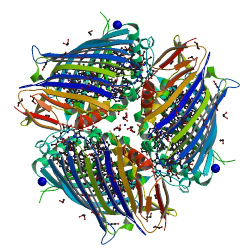
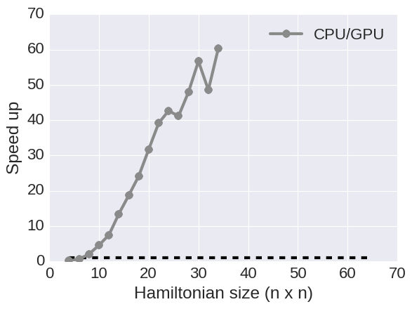
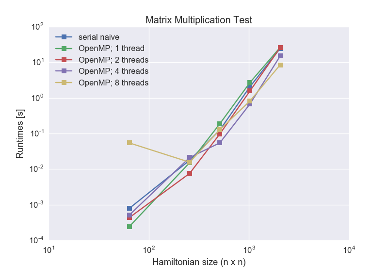
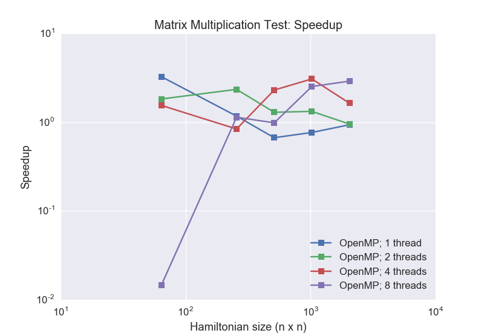
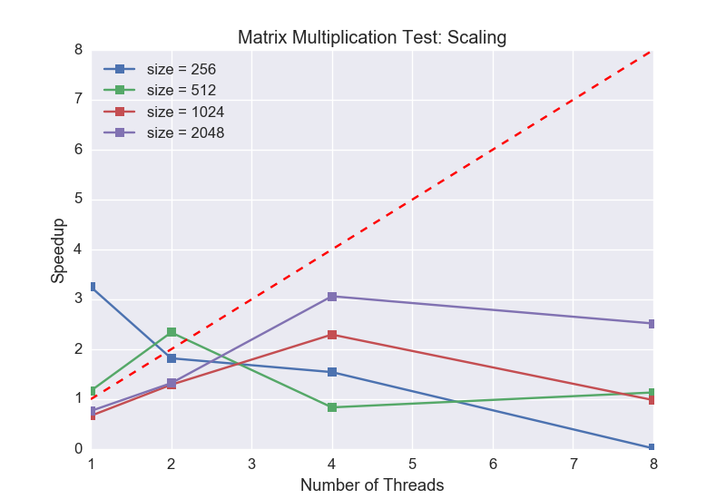

#CS205 Final project
#Implementation and parallelization of the secular Redfield equations

Florian Hase, Hannah Sim, and Teresa Tamayo

The critical process of energy harvesting in solar cells is to quickly convert excited states generated by photon absorption into separated charge carriers for long term energy storage. Nature has developed highly efficient and fast complexes which mediate the transfer of excited state energies from the light harvesting molecules, which absorb photons, to the location where the harvested energy is used to initiate a cascade of chemical reactions. These complexes are collectively referred to as Light-harvesting complexes.

 

**Figure:** Cartoon and stick representation of the Fenna-Matthews-Olson (FMO) complex. The FMO complex is a photosynthetically active protein complex in green sulfur bacteria consisting of three subunits with eight bacteriochlorophylls each. Highly efficient excited state transfer is mediated by this pigment-protein complex due to the close-to-optimal geometrical arrangment of the bacteriochlorophyll molecules within the protein shell. 

Understanding the energy transfer in photosynthesis from the absorption of the photon to the charge separation is crucial for improving the efficiency of solar cells. However, experimental techniques for measuring the transfer of excited states are limited due to short time scales and tight packing of excitation sites. 

Nevertheless the dynamics of excited states in protein complexes has been studied extensively in computer simulations. Several theoretical models at different levels exist to describe the exciton dynamics but even the simplest suitable models can only be applied to a relatively small number of excitonic sites (< 30) due to the computational scaling of the algorithms with the number of excitonic sites in the considered system. 

In this project we focus on an implementation of the secular Redfield equation for exciton transfer and parallelize this method for computing the time evolution of an open quantum system. Using sophisticated programming models and combining them in hybrid implementations we hope to ease the curse of scalability for this particular problem and reach complex sizes beyond the currently accessible. 

## <i class="fa fa-check-square" aria-hidden="true"></i> Redfield method

The dynamics of excited states can be described in terms of the time evolution of a density matrix $\rho(t)$. The time evolution of excited states is hereby not only influenced by interaction among the excited states in the system but also by interactions between the system and the environment, commonly referred to as the bath. Due to the large number of degrees of freedom the interactions between system and bath cannot be treated explicitly in a quantum mechanical framework. However, the effect of the bath on the system can be modeled implicitly by accounting for environmental influences in a generalized Liouville-von Neumann equation. 

The Redfield approximation furthermore assumes a weak coupling between the system and the bath. With the additional approximation that only certain resonant modes couple between the system and the bath we can then finally write a master equation for excited state energy time evolution in the form of a Lindblad equation. 

Considering a system with $N$ sites and a Hamiltonian $H$, the time evolution of the density matrix $\rho(t)$ in the Redfield master equation is defined as 

$$
\frac{d\rho(t)}{dt} = - \frac{i}{\hbar} \left[ H, \rho(t) \right] + \sum\limits_{m,M,N} \gamma(\omega_{MN}) \left( V_m(\omega_{MN}) \rho(t) V^\dagger_m(\omega_{MN}) - \frac{1}{2} V_m^\dagger(\omega_{MN}) V_m(\omega_{MN}) \rho(t) - \frac{1}{2} \rho(t) V^\dagger_m(\omega_{MN}) V_m(\omega_{MN}) \right )
$$

where $\gamma$ denotes transition rates between the excitonic states in the system and $V$ are transition matrices defined as

$$
V_m(\omega) = \sum\limits_{\omega, M, N} c^*_m(M) c_m(N) |M \rangle \langle N | \delta(\omega\hbar - E_M + E_N)
$$

The first term of the differential equation for the density matrix accounts for the time evolution of the excitonic system alone while the second term is used to compute the influence of the environment on the dynamics of the excitonic system. 

Solving this form of the Redfield master equation numerically involves a number of matrix operations. Due to the summation in the second term of the differential equation, from hereon referred to as the Lindblad operator term, a naive algorithm is expected to scale as  with  the number of sites in the system.  

In addition to the interaction between the excitonic sites and the interaction between the excitonic sites and the environment we also need to model two more phenomena: the decay of excited states back to the ground state and the decay of an excited state into the target state, where charge separation takes place. Both of these effects, however, can easily be incorporated into the established formalism by adding two additional states to the density matrix, one for the molecular ground state (loss state) and one for the exciton transfer target (target state). The size of all implemented matrices is therefore always $N + 2$, with $N$ excitonic states, one loss state and one target state. 

## <i class="fa fa-check-square" aria-hidden="true"></i>  Previous implementations

A number of methods has been developed for computing the exciton dynamics of open quantum systems. The Aspuru-Guzik group at the Department of Chemistry and Chemical Biology has acquired some expertise on this topic and already developed some computational methods for computing the time evolution of excited states in such complexes. However, the so far implemented methods do not scale well beyond systems with more than 30 excitonic sites.

Our goal is therefore to employ the Redfield method as a compromise of physical correctness and parallelizability to go beyond this limit and explore the space of large excited state systems. 

## <i class="fa fa-check-square" aria-hidden="true"></i>  Approaching the problem - A naive Python implementation

To better understand the secular Redfield approximation for propagating excitonic systems under a given Hamiltonian we implemented a naive Python version of the Redfield method for two reasons: to determine computationally demanding pieces of the algorithm and design optimizations on the general algorithm structure to bypass these bottlenecks. The density matrix was updated in a simple Euler integration scheme for this purpose. With this naive implementation we were able to confirm the scaling of the method as $N^6$ and determine the parts of the algorithm which are time consuming but suited for parallelization. 

**Figure:** Runtimes of two naive Python implementations. Excitonic systems of size (n x n) were propagated for 10 integration steps with a simple Euler integration. Scalings of both, a naive Python implementation and a vectorized Python implementation, are as expected. 

In particular we found that, as suggested by the form of the equation, the computation of the density matrix update in the secular Redfield approximation can be well divided into two major contributions, the commutator with the Hamiltonian and the action of the Lindblad operator on the density matrix. 

While naively all three matrices, the Hamiltonian H, the density matrix rho and the transition matrices V are complex valued we found that the complex phase can be omitted for the Hamiltonian and the transition matrices, which allows us to implement these matrices as purely real valued. 

Furthermore, there is no reason to compute the exciton dynamics in the site bases, in which Hamiltonian and density matrix are non-diagonal. Instead, we found that as the diagonalization of the Hamiltonian is necessary anyways to compute the transition matrices, one can very well compute the time evolution of the density matrix in the eigenbasis of the Hamiltonian to further reduce the computational cost of evaluating the commutator. 

Regarding the Lindblad operator we noticed that the transition matrices are independent from current time step, which allows to compute the transition matrices at the very beginning of the propagation and store them in memory for later usage. This was also found to be true for the transition rates. 

With all these observations for implementing a faster propagation algorithm we are still left with the three dimensional sum in the Lindblad operator, which remains to be the most expensive piece of the algorithm. We therefore focus our parallelization efforts on this part of the equation. 

## <i class="fa fa-check-square" aria-hidden="true"></i>  Preparations for a more efficient implementation 

In a naive implementation of the secular Redfield method all appearing matrices, including the Hamiltonian $H$, the density matrix $\rho$ and the transition matrices $V$ would have to implemented as complex valued matrices. All three matrices would be dense and we would have to carry out a number of complex-valued matrix-matrix multiplications. However, it turns out that due to some physical properties of the matrices we can make so simplifications and save a significant number of operations. 

First of all, the Hamiltonian 

Our first approach will be implement a serial version of the
solver with a variety of numerical implementations to
perform the time propagations, including different numbers 
of vibrational states in the bath.
Later, we explore different parallelization schemes
with hybrid architectures.
Finally, we will compare our results with an state-of-the-art 
implementation of hierarchical equations of motion [6,7].

There are a wide variety of methods that can obtain the exciton dynamics, some of them
departs on the Redfield equations.
One straightforward implementation is build and diagonalize the Liouville superoperator,
and if we use a time-independent Hamiltonian, the compuational effor scales 

 where , 
is the number of the basis of vibrational states.
This strategy can be numericall unstable in some case.
Finally, there are other approaches where by rewritting the Redfield equation and making futher
approximation, there is only needed matrix-matrix multiplications, hence the computational time scales
is 
[5].

## <i class="fa fa-check-square" aria-hidden="true"></i>  C implementations

Due to the computational demand of a Python implementation we quickly realized that our integration scheme will benefit from switching to numerically more efficient languages such as C. 

## <i class="fa fa-check-square" aria-hidden="true"></i>  Parallelizing Redfield for GPUs: OpenACC implementation 

Encouraged by the speed up we already observed by translating the code from Python to C we wanted to make use of the computational power of GPUs and speed up the code even further by parallelizing the propagation step, in particular the highly demanding computation of the Lindblad operator term in the Redfield equation. 

We observed the largest speed up when parallizing matrix operations between the density matrix and the transition matrices on the warp and thread level and distributing one of the loops for computing these terms on the thread block level. With this computation scheme we were forced to allocate N copies of the transition matrices to avoid race conditions between thread blocks. 

With this implementation we achieved the run times and speed ups shown below. Times were measured for 10 iterations of the 4th order Runge Kutta integration scheme. Calculations were run on a NVIDIA Tesla K80 GPU. 

 

As displayed in the benchmark plot above we achieve significantly smaller runtimes with the parallelized code, which allows us to compute the population dynamics in much larger excitonic systems. 

 

## <i class="fa fa-check-square" aria-hidden="true"></i>  Advanced Features: OpenMP implementation

To explore other parallelization models besides OpenACC, we implemented our code using OpenMP, which supports shared memory multiprocessing programming. As mentioned earlier, we focused on parallelizing the propagation of the density matrix for precomputed Hamiltonians and Lindblad operators. To determine the optimal number of threads, we implemented a simple matrix-matrix multiplication code and plotted OpenMP's performance considering various Hamiltonian sizes and number of threads:

 

We can see from the performance plots that simply increasing the number of threads does not improve performance. In addition, for smaller matrix sizes (<100), which is the size we're primarily interested in, using 2 or more threads led to worse performance. However, using OpenMP with a single thread is comparable to using the serial code. Therefore, more consideration may be needed to effectively apply OpenMP for our problem.

## <i class="fa fa-check-square" aria-hidden="true"></i>  References
[1] P. Rebentrost, R. Chakraborty, and A. Aspuru-Guzik, *J. Chem. Phys.*, **131**, 184102 (2009).

[2] P., M. Mohseni, I. Kassal, S. Lloyd, and A. Aspuru-Guzik, *New Journal of Physics*, **11**, 033003 (2009).

[3] V. May and O. Kühn, *Charge and Energy Transfer Dynamics in Molecular Systems*, Wiley, New York, 2004. 

[4] H. P. Breuer, and F. Petruccione, *The theory of open quantum systems*, Oxford, New York, 2010.

[5] I. Kondov, U. Kleinekathöfer, and M. Schreiber, *J. Chem. Phys.*,  **114**, 1497 (2001).

[6] C. Kreisbeck and T. Kramer, *J. Phys. Chem.* **3**, 2828, (2011).

[7] C. Kreisbeck and T. Kramer "Exciton Dynamics Lab for Light-Harvesting Complexes (GPU-HEOM)," https://nanohub.org/resources/gpuheompop, (DOI: 10.4231/D3QB9V630), (2014).
